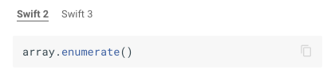
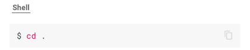

[![PyPI][pypi-image]][pypi-link]

  [pypi-image]: https://img.shields.io/pypi/v/markdown-fenced-code-tabs.svg
  [pypi-link]: https://pypi.python.org/pypi/markdown-fenced-code-tabs

# Markdown Code Tabs Extension

Generates Bootstrap HTML Tabs for Consecutive Markdown Fenced Code Blocks

```md
    ```http
    GET / HTTP/1.1
    User-Agent: MyClient/1.0.0
    Accept: application/vnd.travis-ci.2+json
    Host: api.travis-ci.org

    HTTP/1.1 200 OK
    Content-Type: application/json

    {"hello":"world"}
    ```

    ```shell
    $ travis raw /
    {"hello":"world"}
    ```

    ```ruby
    require 'travis'

    # You usually don't want to fire API requests manually
    client = Travis::Client.new
    client.get_raw('/') # => {"hello"=>"world"}

    client.get('/repos/sinatra/sinatra')
    # => {"repo"=>#<Travis::Client::Repository: sinatra/sinatra>}
    ```
```

Becomes:


To customize the tab label, add the `fct_label` option to your code block.

```md
    ```swift fct_label="Swift 2"
    array.enumerate()
    ```

    ```swift fct_label="Swift 3"
    array.enumerated()
    ```
```



## Installation

Install the latest version with `pip`:
```sh
pip install markdown-fenced-code-tabs
```

## MkDocs Usage

```yml
markdown_extensions:
  - markdown_fenced_code_tabs:
      single_block_as_tab: True
```

## Options

### `single_block_as_tab`
If `True`, the extension will render a single code block as a tab. Default is `False`.

`single_block_as_tab: True` generates:



`single_block_as_tab: False` generates:


## License

MIT License

Copyright (c) 2017 Yassir Barchi

Permission is hereby granted, free of charge, to any person obtaining a copy of this software and associated documentation files (the "Software"), to deal in the Software without restriction, including without limitation the rights to use, copy, modify, merge, publish, distribute, sublicense, and/or sell copies of the Software, and to permit persons to whom the Software is furnished to do so, subject to the following conditions:

The above copyright notice and this permission notice shall be included in all copies or substantial portions of the Software.

THE SOFTWARE IS PROVIDED "AS IS", WITHOUT WARRANTY OF ANY KIND, EXPRESS OR IMPLIED, INCLUDING BUT NOT LIMITED TO THE WARRANTIES OF MERCHANTABILITY, FITNESS FOR A PARTICULAR PURPOSE AND NON-INFRINGEMENT. IN NO EVENT SHALL THE AUTHORS OR COPYRIGHT HOLDERS BE LIABLE FOR ANY CLAIM, DAMAGES OR OTHER LIABILITY, WHETHER IN AN ACTION OF CONTRACT, TORT OR OTHERWISE, ARISING FROM, OUT OF OR IN CONNECTION WITH THE SOFTWARE OR THE USE OR OTHER DEALINGS IN THE SOFTWARE.
